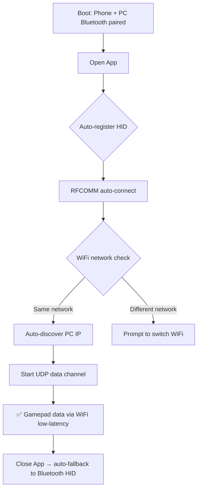

# 🎮 HidBridge

<div align="center">

**Turn your Android device into a gamepad bridge for PC — USB gamepad + Bluetooth/WiFi dual-channel, achieving 2ms low-latency gaming control**

[](LICENSE)
[](https://android.com)
[](https://kotlinlang.org)
[](https://github.com/xiaohaizi590/HidBridge/releases)
[](https://github.com/xiaohaizi590/HidBridge/actions/workflows/build.yml)

[中文 README](README.md)

</div>

---

## ✨ Features

- **🔌 Physical Gamepad Bridging** — Plug-and-play USB-C stretch gamepad, solves PC Bluetooth compatibility issues
- **🎯 Dual-Channel Fusion** — Bluetooth HID fallback + WiFi UDP primary channel, automatic zero-switching
- **⚡ Ultra-Low Latency** — 125-750Hz adjustable polling rate, as low as 2ms in WiFi mode
- **🖥️ Virtual Xbox Gamepad** — ViGEmBus driver-level injection, compatible with all Xbox games
- **📦 Zero Configuration** — PC `receiver.exe` is a single-file green executable, auto-deploys on first run

## 📋 Table of Contents

- [Quick Start](#-quick-start)
- [Installation](#-installation)
- [Usage](#-usage)
- [Architecture](#-architecture)
- [Protocol](#-protocol)
- [FAQ](#-faq)
- [Build](#-build)
- [Tech Stack](#-tech-stack)
- [Contributing](#-contributing)
- [License](#-license)

---

## 🚀 Quick Start

### Three Steps to Get Started

```
┌──────────────┐     ① Bluetooth Pair     ┌──────────────┐
│  Android App  │◀──────────────────────▶│   Windows PC │
│  (HidBridge)  │                        │              │
└──────┬───────┘                        └──────┬───────┘
       │                                      │
       │ ② Push Installer                     │ Run receiver.exe
       │                                      │ (auto installs driver)
       │                                      │
       ▼                                      ▼
┌──────────────┐     ③ WiFi Bridge      ┌──────────────┐
│  USB Gamepad  │──────────────────────▶│ Virtual Xbox │
│  (OTG)        │  UDP 2ms low-latency   │  360 Pad     │
└──────────────┘                        └──────────────┘
```

1. **PC Setup**: Run `receiver.exe` on first use — it auto-installs the ViGEmBus virtual driver
2. **Connect**: Plug USB-C stretch gamepad into phone (OTG), pair phone Bluetooth with PC
3. **Enable Bridge**: Open app → discover PC IP → enable WiFi bridge → play

---

## 📦 Installation

### Hardware Requirements

| Item | Minimum |
|------|---------|
| Phone | Android 9+ (API 28+), Bluetooth HID Device support |
| PC | Windows 10/11, Bluetooth adapter (same LAN for WiFi bridge) |
| Gamepad | USB-C stretch gamepad (Bluetooth gamepads conflict with HID role) |

### PC Setup

```bash
# 1. Push receiver.exe to PC via Bluetooth from the app
# 2. Run as Administrator on PC
receiver.exe --install

# Auto-completes:
#  ✓ ViGEmBus virtual driver installation
#  ✓ Copy to %LOCALAPPDATA%\HidReceiver\
#  ✓ Register autostart
#  ✓ Hidden background operation
```

### Android App

```bash
# Option 1: Download APK from GitHub Releases
# Option 2: Build from source
git clone https://github.com/xiaohaizi590/HidBridge.git
cd HidBridge
./gradlew assembleRelease
# Output: app/build/outputs/apk/release/HidBridge-v1.3.0.apk

# Install
adb install HidBridge-v1.3.0.apk
```

Grant **Bluetooth**, **Location**, and **Nearby Devices** permissions on first launch.

---

## 🎮 Usage

### Daily Workflow



### Connection Modes

| Mode | Path | Latency | Use Case |
|------|------|---------|----------|
| Bluetooth HID only | Phone → Bluetooth → PC | 20-50ms | Power saving, wireless freedom |
| WiFi Bridge | Phone → WiFi UDP → PC | **2-5ms** | Gaming, low latency |
| Hybrid | Both channels | Auto-switch | Auto-fallback on WiFi disconnect |

### Polling Rate

| Level | Rate | Interval | Recommendation |
|-------|------|----------|----------------|
| Power Save | 125Hz | 8ms | Bluetooth default, daily |
| Balanced | 250Hz | 4ms | Casual gaming |
| Esports | 500Hz | 2ms | WiFi default, action/racing |
| Extreme | 750Hz | ~1.3ms | Fighting/hardcore |

---

## 🏗️ Architecture

### System Overview

```
┌─────────────────── Android Phone ───────────────────┐     ┌─────────────────── Windows PC ──────────────────────┐
│                                                      │     │                                                      │
│  ① BluetoothHidDevice                               │     │  Windows HID Stack                                    │
│     HID registration (Keyboard+Mouse+Gamepad)         │────▶│  Plug-and-play, all HID games supported               │
│     HID Report: 8B Keyboard / 4B Mouse / 11B Gamepad  │     │                                                      │
│                                                      │     │                                                      │
│  ② WifiCommandBridge (RFCOMM Server)                 │     │  receiver.exe (C)                                     │
│     BluetoothServerSocket listener                    │◀────│     RFCOMM client connection                          │
│     Text-line protocol + JSON state machine            │     │     Command parsing / IP reply / heartbeat            │
│                                                      │     │                                                      │
│  ③ UdpBridge                                        │     │  receiver.exe (C)                                     │
│     Variable-rate 24B gamepad packets → PC            │────▶│     UDP recv → Parse → ViGEmBus → Virtual Xbox 360     │
│     4B ACK confirmation                                │◀────│     ACK per frame                                     │
│                                                      │     │                                                      │
└──────────────────────────────────────────────────────┘     └──────────────────────────────────────────────────────┘
```

### Android Modules

| Module | File | Responsibility |
|--------|------|---------------|
| HID Engine | `bluetooth/BluetoothKeyboardManager.kt` | HID registration, pairing, reports |
| Input Bridge | `input/InputBridge.kt` | Physical gamepad → HID report mapping |
| UDP Sender | `input/UdpBridge.kt` | Variable rate, ACK, auto-discovery |
| RFCOMM Channel | `wifi/WifiCommandBridge.kt` | Bluetooth SPP channel management |
| State Machine | `wifi/WifiCommandHandler.kt` | JSON commands, WiFi detection, heartbeat |
| UI | `ui/HidScreen.kt` | Bluetooth, WiFi bridge, rate slider |
| Keep-Alive | `service/HidKeepAliveService.kt` | Foreground service |

### PC receiver.exe

Single-file green executable, written in C, zero DLL dependencies, 1-5MB.

| Feature | Implementation |
|---------|---------------|
| UDP | `winsock2.h` native API |
| Virtual Gamepad | ViGEmClient C API (statically linked) |
| Driver Install | Embedded ViGEmBus_Setup.exe, `/S` silent |
| UAC Elevation | `ShellExecuteW("runas", ...)` |
| Autostart | `RegSetValueExW` to `HKCU\...\Run` |
| Background | Hidden console + system tray |

---

## 📡 Protocol

### RFCOMM Command Channel

Bluetooth SPP text-line protocol, UTF-8, `\n` delimited.

| Direction | Command | Description |
|-----------|---------|-------------|
| Phone→PC | `{"cmd":"wifi_info","ssid":"MyWiFi","ip":"192.168.1.5"}` | WiFi same-network check |
| PC→Phone | `{"cmd":"wifi_ok","pc_ip":"192.168.1.100"}` | Same network + PC IP reply |
| PC→Phone | `{"cmd":"wifi_mismatch","my_ssid":"OtherWiFi"}` | Different network |
| Phone→PC | `{"cmd":"install_driver"}` | Request driver installation |
| PC→Phone | `{"cmd":"driver_ok"}` / `driver_installed_ok` | Driver status |
| Phone→PC | `{"cmd":"start_udp"}` | Start UDP data channel |
| PC→Phone | `{"cmd":"udp_ready"}` | UDP channel ready |
| Phone→PC | `ping` / PC→Phone `pong` | Heartbeat (2s) |
| Phone→PC | `{"cmd":"set_rate","hz":500}` | Switch polling rate |

### UDP Data Protocol

**Port**: 47808, **Packet Size**: 24 bytes, little-endian

| Offset | Type | Field | Description |
|--------|------|-------|-------------|
| 0 | uint32 | seq | Auto-increment sequence |
| 4 | uint32 | mask | 18-bit button bitmap |
| 8 | float | leftX | Left stick X: -1.0 ~ 1.0 |
| 12 | float | leftY | Left stick Y |
| 16 | float | rightX | Right stick X |
| 20 | float | rightY | Right stick Y |

### Button Bitmap Mapping

| Bit | Button | XInput | Bit | Button | XInput |
|-----|--------|--------|-----|--------|--------|
| 0 | A | 0x1000 | 8 | Select | 0x0020 |
| 1 | B | 0x2000 | 9 | Start | 0x0010 |
| 2 | X | 0x4000 | 10 | L3 | 0x0040 |
| 3 | Y | 0x8000 | 11 | R3 | 0x0080 |
| 4 | LB | 0x0100 | 12 | DPadUp | 0x0001 |
| 5 | RB | 0x0200 | 13 | DPadDown | 0x0002 |
| 6 | LT | Analog trigger | 14 | DPadLeft | 0x0004 |
| 7 | RT | Analog trigger | 15 | DPadRight | 0x0008 |

### ACK Protocol

PC → Phone: 4-byte little-endian uint32 = latest seq number, sent back to source address.

### Stuck-Key Protection

PC releases all keys if no data received for 2+ seconds.

---

## 🔧 FAQ

<details>
<summary><strong>Can't find PC during scan?</strong></summary>

Make sure PC Bluetooth is discoverable and phone has location permission granted.
</details>

<details>
<summary><strong>Paired but can't connect?</strong></summary>

Unpair and re-pair; confirm Android version ≥ 9.
</details>

<details>
<summary><strong>PC doesn't detect gamepad?</strong></summary>

Check "Control Panel → Game Controllers"; disconnect and reconnect.
</details>

<details>
<summary><strong>WiFi bridge not connecting?</strong></summary>

Confirm phone and PC on same WiFi subnet; receiver.exe is running; firewall allows it.
</details>

<details>
<summary><strong>Input lag/stuttering?</strong></summary>

Switch to WiFi bridge mode; increase polling rate to 500Hz+; disable power saving.
</details>

<details>
<summary><strong>Driver installation failed?</strong></summary>

Run as Administrator; manually download and install ViGEmBus driver.
</details>

---

## 🛠️ Build

### Requirements

- Android SDK 36
- JDK 17
- Kotlin 2.2

### Commands

```bash
# Debug build
./gradlew assembleDebug

# Release build (R8 + resource shrinking)
./gradlew assembleRelease
# Output: HidBridge-v1.3.0.apk

# Clean
./gradlew clean
```

### Project Structure

```
HidBridge/
├── app/src/main/
│   ├── AndroidManifest.xml
│   ├── assets/installer/
│   │   └── receiver.exe              # PC receiver (bundled in APK)
│   ├── java/dev/hid/demo/
│   │   ├── MainActivity.kt            # Entry point
│   │   ├── bluetooth/
│   │   │   └── BluetoothKeyboardManager.kt
│   │   ├── input/
│   │   │   ├── InputBridge.kt
│   │   │   └── UdpBridge.kt
│   │   ├── service/
│   │   │   └── HidKeepAliveService.kt
│   │   ├── ui/
│   │   │   └── HidScreen.kt
│   │   └── wifi/
│   │       ├── WifiCommandBridge.kt
│   │       └── WifiCommandHandler.kt
│   └── res/
├── gradle/
│   ├── wrapper/
│   └── libs.versions.toml
├── build.gradle.kts
├── settings.gradle.kts
└── gradle.properties
```

---

## 📦 Tech Stack

| Layer | Tech | Version |
|-------|------|---------|
| Android | Kotlin | 2.2 |
| UI | Jetpack Compose + Material3 | - |
| Build | Android Gradle Plugin | 9.2 |
| minSdk | Android 9 (API 28) | - |
| targetSdk | Android 16 (API 36) | - |
| PC | C (C11) / MSVC static | - |
| Driver | ViGEmBus SDK | - |
| Protocol | UDP + RFCOMM (Bluetooth SPP) | - |

No third-party business libraries; only official AndroidX dependencies.

---

## 🤝 Contributing

Contributions are welcome! Please read [CONTRIBUTING.md](CONTRIBUTING.md) for details.

1. Fork this repository
2. Create your feature branch (`git checkout -b feature/amazing-feature`)
3. Commit your changes (`git commit -m 'feat: add amazing feature'`)
4. Push to the branch (`git push origin feature/amazing-feature`)
5. Open a Pull Request

### TODO

- [ ] PC RFCOMM client implementation
- [ ] End-to-end integration testing
- [ ] Low battery/high load degradation
- [ ] Input latency optimization
- [ ] Custom button mapping UI
- [ ] Multi-gamepad support

---

## 📄 License

This project is licensed under the [Non-Commercial License](LICENSE) — **commercial use is prohibited**.
