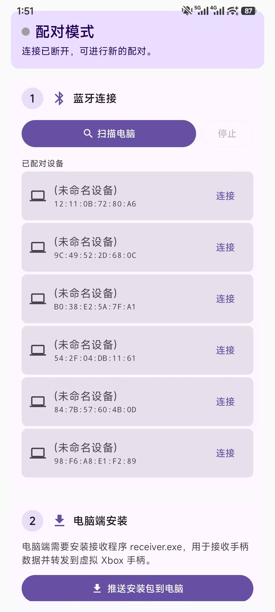
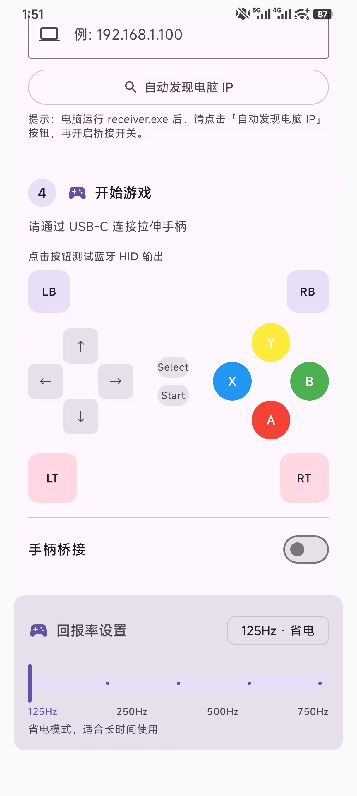

# 🎮 HidBridge

<div align="center">

**安卓手机/旧手机变游戏手柄桥接器 · USB-C 物理手柄 · 蓝牙 + WiFi 双通道 · 2ms 级低延迟**

[](LICENSE)
[](https://android.com)
[](https://kotlinlang.org)
[](https://github.com/xiaohaizi590/HidBridge/releases)

[English README](README.en.md) · [下载 APK](https://github.com/xiaohaizi590/HidBridge/releases)

</div>

<div align="center">
  <table>
    <tr>
      <td align="center" width="50%">
        
        <br />
        <sub>主界面</sub>
      </td>
      <td align="center" width="50%">
        
        <br />
        <sub>使用示例</sub>
    </tr>
  </table>
</div>

---

## ✨ 特性

<table align="center">
<tr>
<td align="center" width="25%"><h3>🔌 物理手柄桥接</h3>USB-C 拉伸手柄即插即用，解决电脑蓝牙兼容性问题</td>
<td align="center" width="25%"><h3>🎯 双通道融合</h3>蓝牙 HID 兜底 + WiFi UDP 主通道，自动切换零感知</td>
<td align="center" width="25%"><h3>⚡ 极致低延迟</h3>125~1000Hz 五档可调回报率，WiFi 模式低至 2ms</td>
</tr>
<tr>
<td align="center" width="25%"><h3>🖥️ 虚拟 Xbox 手柄</h3>ViGEmBus 驱动级注入，兼容所有 Xbox 游戏</td>
<td align="center" width="25%"><h3>📱 屏幕虚拟手柄</h3>无实体手柄也能玩，Xbox/PS5 双布局可编辑</td>
<td align="center" width="25%"><h3>📳 游戏震动回传</h3>PC 震动命令回传，实体马达优先、手机震动兜底</td>
</tr>
</table>

---

## 🚀 快速开始

### 三步畅玩

```
┌──────────────┐      ① 蓝牙配对       ┌──────────────┐
│   手机 App    │◀────────────────────▶│   电脑       │
│  (HidBridge)  │                     │  (Windows)   │
└──────┬───────┘                     └──────┬───────┘
       │ ② 推送 GamepadBridge.exe                 │ 运行 GamepadBridge.exe
       │                                    │ (自动装驱动)
       ▼                                    ▼
┌──────────────┐      ③ WiFi 桥接       ┌──────────────┐
│  USB 手柄     │─────────────────────▶│  虚拟 Xbox   │
│  (OTG 接入)   │   UDP 2ms 低延迟      │   360 手柄    │
└──────────────┘                     └──────────────┘
```

> **首次使用**：PC 运行 `GamepadBridge.exe` → 手机 USB 插手柄 + 蓝牙配对 → App 开启 WiFi 桥接 → 🎮

---

## 📦 安装

### PC 端

```bash
# 手机 App 推送GamepadBridge.exe（首次），PC 以管理员身份运行
GamepadBridge.exe
# ✅ 自动安装 ViGEmBus 虚拟驱动
# ✅ 自动注册开机自启
# ✅ 首次运行需前台保持
```

### 手机端

**方式一：下载 APK**
- 前往 [Releases](https://github.com/xiaohaizi590/HidBridge/releases) 下载最新版

**方式二：源码构建**
```bash
git clone https://github.com/xiaohaizi590/HidBridge.git
cd HidBridge && ./gradlew assembleRelease
# APK: app/build/outputs/apk/release/HidBridge-v1.3.3.6.apk
```

**安装后**：授予蓝牙、位置、附近设备权限

---

## 🎮 功能展示

### 连接模式

| 模式 | 延迟 | 适用场景 |
|------|------|----------|
| 纯蓝牙 HID | 20-50ms | 省电、无线自由 |
| **WiFi 桥接** | **2-5ms** | 电竞、低延迟 |
| 混合模式 | 自动切换 | WiFi 断流自动回退蓝牙 |

### 回报率

| 档位 | 频率 | 场景 |
|------|------|------|
| 省电 | 125Hz | 日常、蓝牙模式默认 |
| 均衡 | 250Hz | 普通游戏 |
| **电竞** | **500Hz** | WiFi 默认 |
| 极致 | 750Hz | 格斗/硬核 |
| 超频 | 1000Hz | 追求极限 |

### 屏幕虚拟手柄

无实体手柄时可直接用屏幕虚拟手柄，Xbox Series / PS5 双布局：

- 3D 立体按键、模拟摇杆（L3/R3 保持）、十字键斜向组合
- 按键布局可自由编辑，持久化保存
- 按键震动反馈、游戏震动回传可单独开关
- 纯黑全屏游戏模式，隐藏系统栏防误触

### 游戏震动回传

PC 端游戏震动命令经 UDP（47810）+ RFCOMM 双通道回传手机：

| 执行器 | 说明 |
|------|------|
| 实体手柄马达 | USB-C 拉伸手柄支持时优先驱动（SET_REPORT） |（待改进，测试功能）
| 手机震动 | 无马达手柄/模拟手柄时降级，主界面可开关 |

---

## 🏗️ 架构

```
┌──── Android 手机 ────┐     ┌──── Windows 电脑 ────┐
│ BluetoothHidDevice    │────▶│ Windows HID 栈        │
│ InputBridge (手柄)    │     │ GamepadBridge.exe          │
│ VirtualGamepad (模拟) │     │   RFCOMM 命令通道     │
│ WifiCommandBridge     │◀────│   UDP → ViGEmBus      │
│ UdpBridge (UDP 发送)  │────▶│                       │
│ VibrateManager (震动) │◀────│   震动回传 47810/命令  │
└───────────────────────┘     └───────────────────────┘
```

---

## 📡 协议

### RFCOMM 命令通道

蓝牙 SPP，UTF-8 文本行协议：

```
手机→PC: {"cmd":"wifi_info","ssid":"MyWiFi","ip":"192.168.1.5"}
PC→手机: {"cmd":"wifi_ok","pc_ip":"192.168.1.100"}
手机→PC: {"cmd":"start_udp"}
PC→手机: {"cmd":"udp_ready"}
```

### UDP 数据协议

端口 **47808**，24 字节小端：

| 偏移 | 类型 | 字段 | 说明 |
|------|------|------|------|
| 0 | uint32 | seq | 自增序号 |
| 4 | uint32 | mask | 按键位图 |
| 8-20 | float[4] | LX/LY/RX/RY | 摇杆数据 |

---

## ❓ 常见问题

<details><summary><strong>手机扫描不到电脑？</strong></summary>

确认电脑蓝牙可发现，手机已授予位置权限。
</details>

<details><summary><strong>电脑没识别到手柄？</strong></summary>

控制面板 → 游戏控制器 检查；确保 GamepadBridge.exe 正在运行。
</details>

<details><summary><strong>WiFi 桥接连不上？</strong></summary>

确认同网段、GamepadBridge.exe 运行中、防火墙已放行。
</details>

<details><summary><strong>按键卡顿？</strong></summary>

切换 WiFi 模式，提高回报率到 500Hz+，关闭省电模式。
</details>

---

## 🛠️ 开发

### 环境

- Android SDK 36 · JDK 17 · Kotlin 2.2

### 构建

```bash
./gradlew assembleRelease   # 输出 HidBridge-v1.3.3.6.apk
```

### 项目结构

```
HidBridge/
├── app/src/main/
│   ├── assets/installer/GamepadBridge.exe
│   ├── java/dev/hid/demo/
│   │   ├── bluetooth/     # HID 引擎 + 配对连接
│   │   ├── input/          # 手柄桥接 / UDP / 虚拟手柄输入
│   │   ├── wifi/           # RFCOMM 命令通道
│   │   ├── service/        # 前台保活 + 震动回传执行器
│   │   └── ui/             # Compose 界面（主界面/虚拟手柄/黑屏）
│   └── res/
└── gradle/
```

---

## 📦 技术栈

| 层 | 技术 |
|----|------|
| 手机 | Kotlin 2.2 · Jetpack Compose · Material3 |
| PC | C (C11) · ViGEmBus SDK · winsock2 |
| 协议 | UDP + RFCOMM (蓝牙 SPP) |

---

## 🤝 贡献

欢迎贡献代码！[CONTRIBUTING.md](CONTRIBUTING.md)

1. Fork → 2. 分支 → 3. Commit → 4. Push → 5. PR

---

## 📄 许可证

[非商业许可证](LICENSE) · **禁止商业使用**

---

<div align="center">
  <sub>Made with ❤️ for gamers who love their old phones</sub>
</div>
