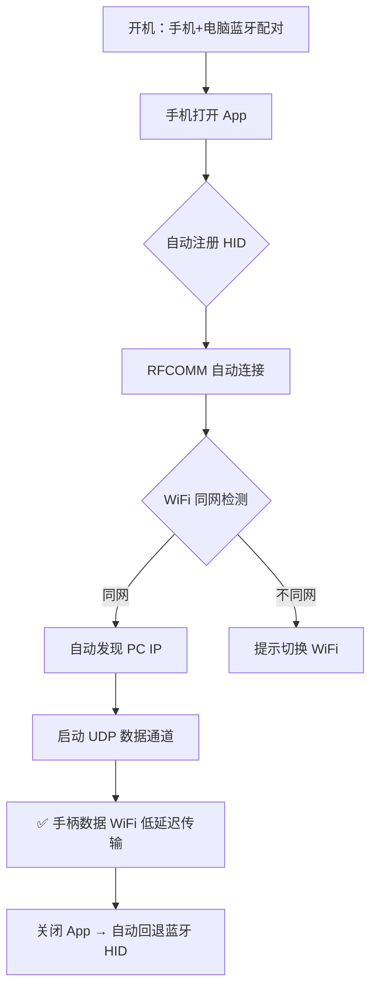

# 🎮 手柄桥 (HidBridge)

<div align="center">

**将安卓设备变为电脑游戏手柄桥接器 — USB 拉伸手柄 + 蓝牙/WiFi 双通道，实现 2ms 级低延迟游戏操控**

[](LICENSE)
[](https://android.com)
[](https://kotlinlang.org)
[](https://github.com/xiaohaizi590/HidBridge/releases)
[](https://github.com/xiaohaizi590/HidBridge/actions/workflows/build.yml)

[English README](README.en.md)

</div>

---

## ✨ 特性

- **🔌 物理手柄桥接** — USB-C 拉伸手柄即插即用，解决电脑蓝牙兼容性问题
- **🎯 双通道融合** — 蓝牙 HID 兜底 + WiFi UDP 主通道，自动切换零感知
- **⚡ 极致低延迟** — 125~750Hz 可调回报率，WiFi 模式低至 2ms
- **🖥️ 虚拟 Xbox 手柄** — ViGEmBus 驱动级注入，兼容所有 Xbox 游戏
- **📦 零配置** — PC 端 `receiver.exe` 单文件绿色免安装，首次运行自动部署

## 📋 目录

- [快速开始](#-快速开始)
- [安装指南](#-安装指南)
- [使用示例](#-使用示例)
- [架构设计](#-架构设计)
- [协议规范](#-协议规范)
- [常见问题](#-常见问题)
- [开发构建](#-开发构建)
- [技术栈](#-技术栈)
- [贡献](#-贡献)
- [许可证](#-许可证)

---

## 🚀 快速开始

### 三步上手

```
┌──────────────┐     ① 蓝牙配对      ┌──────────────┐
│   手机 App    │◀──────────────────▶│   电脑       │
│  (HidBridge)  │                    │  (Windows)   │
└──────┬───────┘                    └──────┬───────┘
       │                                    │
       │ ② 推送安装包                        │ 运行 receiver.exe
       │                                    │  (自动安装驱动)
       │                                    │
       ▼                                    ▼
┌──────────────┐     ③ WiFi 桥接      ┌──────────────┐
│  USB 手柄     │───────────────────▶│ 虚拟 Xbox   │
│  (OTG 接入)   │  UDP 2ms 低延迟     │   360 手柄    │
└──────────────┘                    └──────────────┘
```

1. **PC 准备**：首次运行 `receiver.exe`，自动安装 ViGEmBus 虚拟驱动
2. **手机连接**：USB-C 拉伸手柄插入手机（OTG），手机蓝牙配对电脑
3. **开启桥接**：打开 App → 发现 PC IP → 开启 WiFi 桥接 → 开玩

---

## 📦 安装指南

### 硬件要求

| 项目 | 最低要求 |
|------|----------|
| 手机 | Android 9+ (API 28+)，支持 Bluetooth HID Device |
| 电脑 | Windows 10/11，蓝牙适配器（WiFi 桥接需同局域网） |
| 手柄 | USB-C 拉伸手柄（蓝牙手柄与 HID 角色冲突，不支持） |

### PC 端安装

```bash
# 1. 手机 App 推送 receiver.exe 到电脑（蓝牙分享）
# 2. 电脑上以管理员身份运行
receiver.exe --install

# 自动完成：
#  ✓ ViGEmBus 虚拟驱动安装
#  ✓ 复制到 %LOCALAPPDATA%\HidReceiver\
#  ✓ 注册开机自启
#  ✓ 隐藏后台运行
```

### 手机端安装

```bash
# 方式一：从 GitHub Releases 下载 APK
# 方式二：源码构建
git clone https://github.com/xiaohaizi590/HidBridge.git
cd HidBridge
./gradlew assembleRelease
# APK 输出：app/build/outputs/apk/release/HidBridge-v1.2.apk

# 安装
adb install HidBridge-v1.2.apk
```

首次启动需授予 **蓝牙**、**位置**、**附近设备** 权限。

---

## 🎮 使用示例

### 日常使用流程



### 三种连接模式

| 模式 | 路径 | 延迟 | 适用场景 |
|------|------|------|----------|
| 纯蓝牙 HID | 手机 → 蓝牙 → 电脑 | 20-50ms | 省电、无线自由 |
| WiFi 桥接 | 手机 → WiFi UDP → 电脑 | **2-5ms** | 电竞、低延迟 |
| 混合模式 | 双通道同时发 | 自动切换 | WiFi 断流自动回退蓝牙 |

### 回报率调节

| 档位 | 回报率 | 间隔 | 推荐场景 |
|------|--------|------|----------|
| 省电 | 125Hz | 8ms | 蓝牙默认、日常办公 |
| 均衡 | 250Hz | 4ms | 普通游戏 |
| 电竞 | 500Hz | 2ms | WiFi 默认、动作/竞速 |
| 极致 | 750Hz | ~1.3ms | 格斗/硬核电竞 |

---

## 🏗️ 架构设计

### 系统架构

```
┌─────────────────── 手机 Android ───────────────────┐     ┌─────────────────── 电脑 Windows ───────────────────┐
│                                                     │     │                                                     │
│  ① BluetoothHidDevice                               │     │  Windows HID 栈                                    │
│     HID 注册（键盘+鼠标+手柄组合）                     │────▶│  即插即用，兼容所有 HID 游戏                          │
│     HID Report: 8B 键盘 / 4B 鼠标 / 11B 手柄           │     │                                                     │
│                                                     │     │                                                     │
│  ② WifiCommandBridge (RFCOMM 服务端)                 │     │  receiver.exe (C)                                    │
│     BluetoothServerSocket 监听                        │◀────│     RFCOMM 客户端连接                                │
│     文本行协议 + JSON 状态机                           │     │     命令解析 / IP 回传 / 心跳                        │
│                                                     │     │                                                     │
│  ③ UdpBridge                                        │     │  receiver.exe (C)                                    │
│     可变回报率 24B 手柄包 → PC                       │────▶│     UDP 接收 → 解析 → ViGEmBus → 虚拟 Xbox 360       │
│     4B ACK 确认                                      │◀────│     每帧 ACK 回包                                    │
│                                                     │     │                                                     │
└─────────────────────────────────────────────────────┘     └─────────────────────────────────────────────────────┘
```

### 手机端核心模块

| 模块 | 文件 | 职责 |
|------|------|------|
| HID 引擎 | `bluetooth/BluetoothKeyboardManager.kt` | HID 注册、配对、键盘/鼠标/手柄报表 |
| 输入桥接 | `input/InputBridge.kt` | 物理手柄事件 → HID 报表映射 |
| UDP 发送 | `input/UdpBridge.kt` | 可变回报率、ACK 确认、PC IP 自动发现 |
| RFCOMM 通道 | `wifi/WifiCommandBridge.kt` | 蓝牙 SPP 命令通道管理 |
| 命令状态机 | `wifi/WifiCommandHandler.kt` | JSON 命令解析、WiFi 同网检测、心跳 |
| UI 界面 | `ui/HidScreen.kt` | 蓝牙连接、WiFi 桥接、回报率滑块 |
| 保活服务 | `service/HidKeepAliveService.kt` | 前台服务防杀进程 |

### PC 端 receiver.exe

单文件绿色 exe，C 语言编写，零 DLL 依赖，体积 1-5MB。

| 功能 | 实现 |
|------|------|
| UDP 通信 | `winsock2.h` 原生 API |
| 虚拟手柄 | ViGEmClient C API（静态链接） |
| 驱动安装 | 资源嵌入 ViGEmBus_Setup.exe，`/S` 静默 |
| UAC 提权 | `ShellExecuteW("runas", ...)` |
| 开机自启 | `RegSetValueExW` 写 `HKCU\...\Run` |
| 后台运行 | 隐藏控制台 + 托盘图标 |

---

## 📡 协议规范

### RFCOMM 命令通道

蓝牙 SPP 文本行协议，UTF-8，`\n` 分隔。

| 方向 | 命令 | 说明 |
|------|------|------|
| 手机→PC | `{"cmd":"wifi_info","ssid":"MyWiFi","ip":"192.168.1.5"}` | WiFi 同网检测 |
| PC→手机 | `{"cmd":"wifi_ok","pc_ip":"192.168.1.100"}` | 同网 + 回传 PC IP |
| PC→手机 | `{"cmd":"wifi_mismatch","my_ssid":"OtherWiFi"}` | 不同网提示 |
| 手机→PC | `{"cmd":"install_driver"}` | 请求驱动安装 |
| PC→手机 | `{"cmd":"driver_ok"}` / `driver_installed_ok` | 驱动状态 |
| 手机→PC | `{"cmd":"start_udp"}` | 启动 UDP 数据通道 |
| PC→手机 | `{"cmd":"udp_ready"}` | UDP 就绪 |
| 手机→PC | `ping` / PC→手机 `pong` | 心跳（2s） |
| 手机→PC | `{"cmd":"set_rate","hz":500}` | 切换回报率 |

### UDP 数据协议

**端口**: 47808，**包长**: 24 字节，小端序

| 偏移 | 类型 | 字段 | 说明 |
|------|------|------|------|
| 0 | uint32 | seq | 自增序号 |
| 4 | uint32 | mask | 18 位按键位图 |
| 8 | float | leftX | 左摇杆 X: -1.0 ~ 1.0 |
| 12 | float | leftY | 左摇杆 Y |
| 16 | float | rightX | 右摇杆 X |
| 20 | float | rightY | 右摇杆 Y |

### 按键位图映射

| Bit | 按键 | XInput | Bit | 按键 | XInput |
|-----|------|--------|-----|------|--------|
| 0 | A | 0x1000 | 8 | Select | 0x0020 |
| 1 | B | 0x2000 | 9 | Start | 0x0010 |
| 2 | X | 0x4000 | 10 | L3 | 0x0040 |
| 3 | Y | 0x8000 | 11 | R3 | 0x0080 |
| 4 | LB | 0x0100 | 12 | DPadUp | 0x0001 |
| 5 | RB | 0x0200 | 13 | DPadDown | 0x0002 |
| 6 | LT | 模拟扳机 | 14 | DPadLeft | 0x0004 |
| 7 | RT | 模拟扳机 | 15 | DPadRight | 0x0008 |

### ACK 协议

PC → 手机：4 字节小端 uint32 = 最近一包 seq，回至包源地址。

### 卡键保护

PC 端超过 2 秒未收到数据 → 自动释放所有按键回中。

---

## 🔧 常见问题

<details>
<summary><strong>扫描不到电脑？</strong></summary>

确认电脑蓝牙可被发现，且手机已授予位置权限。
</details>

<details>
<summary><strong>配对成功但连不上？</strong></summary>

取消配对后重新配对；确认手机 Android 版本 ≥ 9。
</details>

<details>
<summary><strong>电脑没识别到手柄？</strong></summary>

打开「控制面板 → 游戏控制器」检查；断开重连手柄。
</details>

<details>
<summary><strong>WiFi 桥接连不上？</strong></summary>

确认手机与电脑在同一 WiFi 网段；receiver.exe 正在运行；防火墙已放行。
</details>

<details>
<summary><strong>按键卡顿/延迟高？</strong></summary>

切换到 WiFi 桥接模式；提高回报率到 500Hz 以上；关闭省电模式。
</details>

<details>
<summary><strong>驱动安装失败？</strong></summary>

确保以管理员权限运行；手动下载 ViGEmBus 驱动安装。
</details>

---

## 🛠️ 开发构建

### 环境要求

- Android SDK 36
- JDK 17
- Kotlin 2.2

### 构建命令

```bash
# Debug 构建
./gradlew assembleDebug

# Release 构建（R8 混淆 + 资源裁剪）
./gradlew assembleRelease
# 输出: HidBridge-v1.2.apk

# 清理
./gradlew clean
```

### 项目结构

```
HidBridge/
├── app/src/main/
│   ├── AndroidManifest.xml
│   ├── assets/installer/
│   │   └── receiver.exe              # PC 端接收器（随 APK 打包）
│   ├── java/dev/hid/demo/
│   │   ├── MainActivity.kt            # 入口：权限 + 初始化
│   │   ├── bluetooth/
│   │   │   └── BluetoothKeyboardManager.kt  # HID 核心引擎
│   │   ├── input/
│   │   │   ├── InputBridge.kt         # 手柄输入桥接
│   │   │   └── UdpBridge.kt           # UDP 发送端
│   │   ├── service/
│   │   │   └── HidKeepAliveService.kt # 前台保活
│   │   ├── ui/
│   │   │   └── HidScreen.kt           # 主界面
│   │   └── wifi/
│   │       ├── WifiCommandBridge.kt   # RFCOMM 通道
│   │       └── WifiCommandHandler.kt  # 命令状态机
│   └── res/                           # 资源文件
├── gradle/
│   ├── wrapper/
│   └── libs.versions.toml            # 版本目录
├── build.gradle.kts
├── settings.gradle.kts
└── gradle.properties
```

---

## 📦 技术栈

| 层 | 技术 | 版本 |
|----|------|------|
| 手机 | Kotlin | 2.2 |
| 手机 UI | Jetpack Compose + Material3 | - |
| 手机 SDK | Android Gradle Plugin | 9.2 |
| 手机 minSdk | Android 9 (API 28) | - |
| 手机 targetSdk | Android 16 (API 36) | - |
| PC 端 | C (C11) / MSVC 静态链接 | - |
| PC 驱动 | ViGEmBus SDK | - |
| 协议 | UDP + RFCOMM (蓝牙 SPP) | - |

无第三方业务库，仅官方 AndroidX 依赖。

---

## 🤝 贡献

欢迎贡献代码！请阅读 [CONTRIBUTING.md](CONTRIBUTING.md) 了解详情。

1. Fork 本仓库
2. 创建功能分支 (`git checkout -b feature/amazing-feature`)
3. 提交改动 (`git commit -m 'feat: add amazing feature'`)
4. 推送到分支 (`git push origin feature/amazing-feature`)
5. 提交 Pull Request

### 待办任务

- [ ] PC 端 RFCOMM 客户端实现
- [ ] 端到端联调测试
- [ ] 低电量/高负载降级策略
- [ ] 按键延迟优化（节流层合并 + ByteBuffer 复用）
- [ ] 自定义手柄按键映射 UI
- [ ] 多手柄支持

---

## 📄 许可证

本项目基于 [非商业许可证](LICENSE) 开源，**禁止商业使用**。

---

## ⚠️ 风险与边界

| 场景 | 处理 |
|------|------|
| 手机/PC 不同 WiFi | 提示用户切换，蓝牙 HID 继续可用 |
| 用户拒绝驱动安装 | 蓝牙 HID 模式继续可用 |
| RFCOMM 连接失败 | 手动输入 PC IP |
| PC 未运行 receiver | 蓝牙 HID 正常可用 |
| 手机锁屏/WiFi 休眠 | WifiLock 保活 + 心跳 |
| 手机不支持 HID Device | 极少数设备，需 Android 9+ |
| 防火墙拦截 | 首次弹提示，需允许专用网络 |
| 内核驱动提权 | 首次安装需 UAC |
